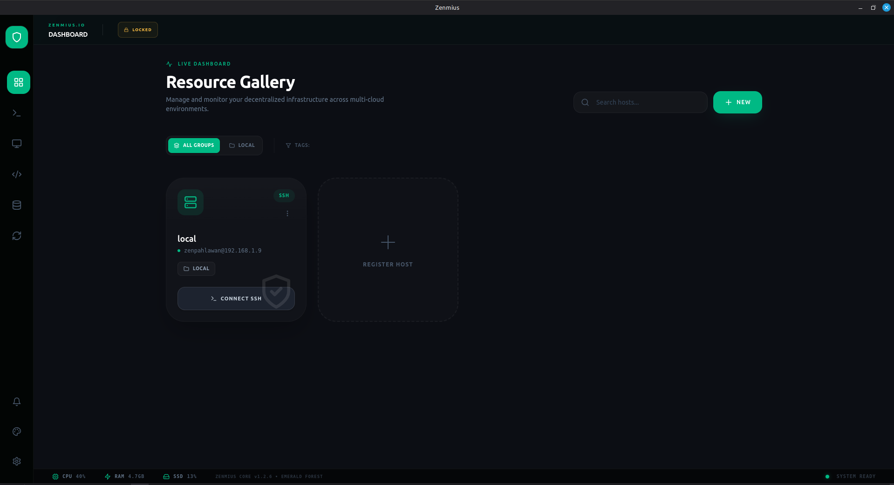

<div align="center">

# Zenmius
### Premium Open Source SSH & Remote Desktop Manager
**Build the Future of DevOps with Style, Security, and Speed.**

[](https://opensource.org/licenses/MIT)
[](https://www.electronjs.org/)
[](https://react.dev/)
[](https://www.typescriptlang.org/)
[]()

<br/>



</div>

---

## 🌟 Introduction

**Zenmius** is not just another terminal client; it's a **command center** for modern infrastructure. Designed for DevOps engineers, system administrators, and developers who demand both **power** and **beauty**, Zenmius unifies SSH, SFTP, and Remote Desktop protocols into a single, high-performance, and secure application.

We believe that professional tools should not only look good but feel amazing to use. With a focus on **Glassmorphism aesthetics**, **smooth animations**, and **intuitive UX**, Zenmius makes managing 100+ servers feel effortless.

---

## ✨ Key Features

### 🖥️ **Next-Gen Connectivity**
- **Hyper-Fast Terminal**: Integrated `xterm.js` with WebGL acceleration for lag-free rendering, supporting split views and custom fonts.
- **Smart SFTP Explorer**: A full-featured file manager that works alongside your terminal. Upload, download, and manage remote files with drag-and-drop support.
- **Remote Desktop (VNC/RDP)**: Manage GUI-based servers seamlessly with built-in remote desktop support.

### ⚡ **Productivity Powerhouse**
- **Command Snippets**: Save complex shell commands as reusable snippets. Tag them (e.g., `#docker`, `#deploy`) for instant retrieval.
- **Broadcast Execution**: Need to update 10 servers at once? Use **Broadcast capability** to run a snippet across all active sessions simultaneously.
- **Host Gallery**: Organize your infrastructure with a visual card-based interface. Filter by tags, status, or groups.

### 🔒 **Military-Grade Security**
- **Zero-Knowledge Vault**: Your credentials never leave your device unencrypted. We use **libsodium** to encrypt passwords, keys, and tokens at rest.
- **Master Password**: The vault is sealed with a master password that decrypts data only in memory.
- **Auto-Lock**: Configurable inactivity timers ensure your workstation remains secure even when you step away.

### ☁️ **Secure Cloud Sync**
- **Git-Based Synchronization**: Sync your vault and configurations across devices using **any private Git repository** (GitHub, GitLab, etc.).
- **Encrypted Push**: Data is encrypted *locally* before being pushed to Git. Even the Git provider cannot read your secrets.
- **Conflict Resolution**: Smart merging strategies handling "Push", "Pull", and "Sync" actions to keep your workspace consistent.

### 🎨 **Dynamic Theming**
- **Theme Studio**: Switch instantly between professionally curated themes like *Indigo Night*, *Emerald Forest*, *Cyberpunk*, and more.
- **Visual Feedback**: The entire UI adapts to your theme, from scrollbars to terminal colors and button shadows.

### 📊 **System Intelligence**
- **Live Logs**: Real-time activity monitoring with timezone-aware timestamps.
- **Resource Monitoring**: Always-on footer display showing your local CPU, RAM, and Storage usage.

---

## 🛠️ Technology Stack

Zenmius is built on a robust, modern stack ensuring cross-platform compatibility and high performance.

| Layer | Technology |
|-------|------------|
| **Core** | [Electron v28](https://www.electronjs.org/) |
| **Frontend** | [React 18](https://react.dev/), [TypeScript](https://www.typescriptlang.org/) |
| **State** | [Zustand](https://github.com/pmndrs/zustand) |
| **Styling** | [TailwindCSS](https://tailwindcss.com/), Framer Motion |
| **Protocols** | `ssh2`, `node-pty`, `isomorphic-git` |
| **Database** | `better-sqlite3` (Local high-perf storage) |
| **Security** | `libsodium` (NaCl) |

---

## 🚀 Getting Started

### Prerequisites
- **Node.js** v18+
- **NPM** or **Yarn**

### Installation

1. **Clone the Project**
   ```bash
   git clone https://github.com/zenpahlawan/zenmius.git
   cd zenmius
   ```

2. **Install Dependencies**
   ```bash
   npm install
   ```

3. **Start Development Mode**
   ```bash
   npm run dev
   ```
   ```
   *This starts the Vite server and Electron app with Hot Module Replacement (HMR).*

   > ⚠️ **IMPORTANT**: The default **Master Password** is `zendemo`.  
   > Please change this immediately in **Settings > Security** after your first login to secure your vault.

4. **Build Distribution**
   ```bash
   npm run build:linux  # or build:win, build:mac
   ```

---

## ⚙️ Configuration & Sync Setup

### **Cloud Sync Setup Guide**

1. **Create an Empty Repo**: Go to GitHub/GitLab and create a private repository (e.g., `my-zenmius-vault`).
2. **Generate Token**: Create a Personal Access Token (PAT) with `repo` scope.
3. **Configure in App**:
   - Go to **Sync** tab in Zenmius.
   - Enter Repo URL, Username, and Token.
   - Click **Save Config**.
4. **Push/Pull**:
   - **Upload**: Click "Push" to encrypt and upload your current setup.
   - **Download**: On a new machine, enter the same details and click "Pull" to restore your environment.

---

## 📂 Project Structure

```bash
zenmius/
├── src/
│   ├── main/                 # Electron Main Process (Backend)
│   │   ├── ssh-manager.ts    # SSH Connection Handling
│   │   ├── vault-manager.ts  # Encryption Logic
│   │   └── ...
│   ├── preload/              # IPC Bridge
│   └── renderer/             # React UI (Frontend)
│       ├── src/
│       │   ├── components/   # UI Components (Terminal, SFTP, etc.)
│       │   ├── store/        # Zustand State Store
│       │   └── assets/       # Themes & Icons
│       └── index.html
├── resources/                # Static assets
└── electron-builder.yml      # Build configuration
```

---

## 🤝 Contributing

Contributions are welcome!
1. Fork the Project
2. Create your Feature Branch (`git checkout -b feature/AmazingFeature`)
3. Commit your Changes (`git commit -m 'Add some AmazingFeature'`)
4. Push to the Branch (`git push origin feature/AmazingFeature`)
5. Open a Pull Request

---

## 📄 License

Distributed under the MIT License. See `LICENSE` for more information.

<div align="center">
    <br/>
    <p>Built with ❤️ by <b>EPX-PANCA a.k.a ZenPahlawan</b></p>
</div>
